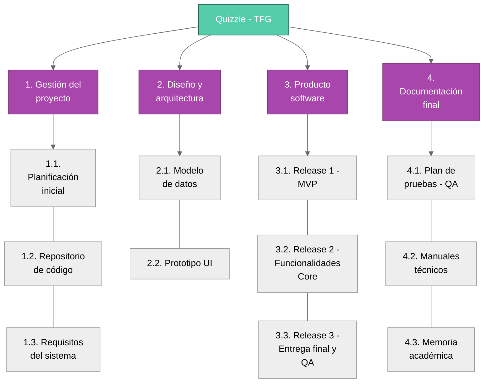

# Diagramas Mermaid

## EDT

```mermaid
%%{init: {'theme': 'neutral'}}%%
graph TD
    Root["Quizzie - TFG"]

    N1["1. Gestión del<br/>proyecto"]
    N2["2. Diseño y<br/>arquitectura"]
    N3["3. Producto<br/>software"]
    N4["4.<br/>Documentación<br/>final"]

    Root --> N1
    Root --> N2
    Root --> N3
    Root --> N4

    N1_1["1.1.<br/>Planificación<br/>inicial"]
    N1_2["1.2. Repositorio<br/>de código"]
    N1_3["1.3. Requisitos<br/>del sistema"]

    N1 --> N1_1
    N1_1 --- N1_2
    N1_2 --- N1_3

    N2_1["2.1. Modelo<br/>de datos"]
    N2_2["2.2. Prototipo UI"]

    N2 --> N2_1
    N2_1 --- N2_2

    N3_1["3.1. Release 1 -<br/>MVP"]
    N3_2["3.2. Release 2 -<br/>Funcionalidades<br/>Core"]
    N3_3["3.3. Release 3 -<br/>Entrega final y<br/>QA"]

    N3 --> N3_1
    N3_1 --- N3_2
    N3_2 --- N3_3

    N4_1["4.1. Plan de<br/>pruebas - QA"]
    N4_2["4.2. Manuales<br/>técnicos"]
    N4_3["4.3. Memoria<br/>académica"]

    N4 --> N4_1
    N4_1 --- N4_2
    N4_2 --- N4_3

    style Root fill:#55ccaa,stroke:#2b6854,color:#fff,stroke-width:1px
    style N1 fill:#a946ab,stroke:#7d386f,color:#fff,stroke-width:1px
    style N2 fill:#a946ab,stroke:#7d386f,color:#fff,stroke-width:1px
    style N3 fill:#a946ab,stroke:#7d386f,color:#fff,stroke-width:1px
    style N4 fill:#a946ab,stroke:#7d386f,color:#fff,stroke-width:1px
```
