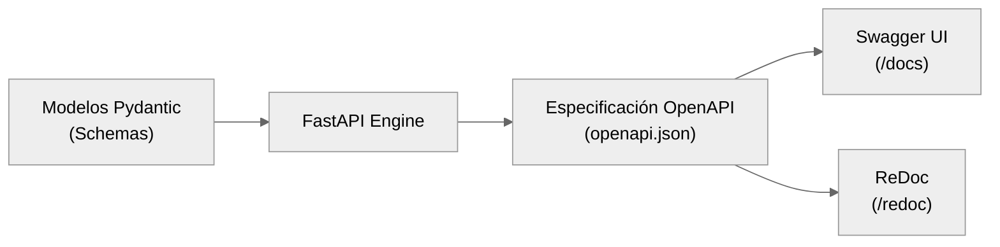
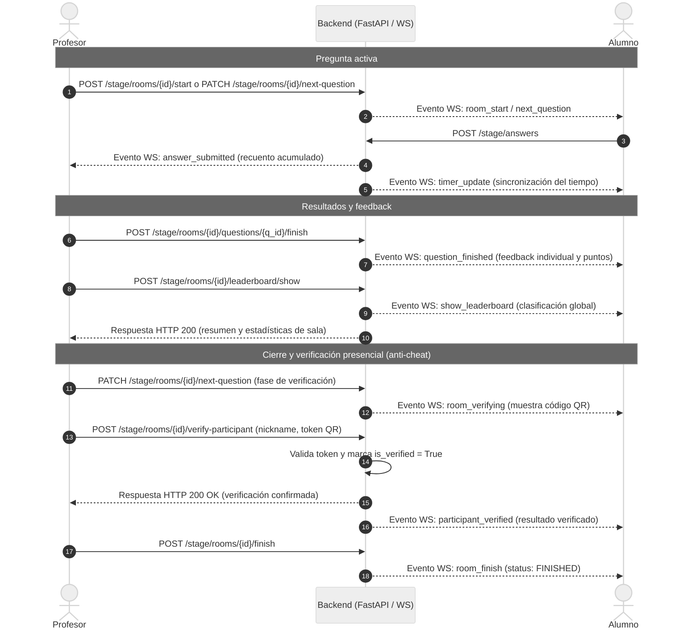

# Documentación de la API - Quizzie

Este documento recopila la especificación técnica de la API de **Quizzie**, detallando los endpoints principales, los esquemas de peticiones y respuestas, el mecanismo de autorización y la integración con el estándar **OpenAPI** (Swagger/ReDoc).

---

## 1. Integración con el estándar OpenAPI

La API de **Quizzie** está desarrollada sobre la infraestructura de **FastAPI**, lo que permite una integración nativa y automatizada con la especificación **OpenAPI (v3.0 / v3.1)**:

* **Autodocumentación interactiva:** El servidor expone dinámicamente dos interfaces gráficas de documentación:
  * **Swagger UI (`/docs`):** Permite explorar y probar interactivamente cada endpoint desde el navegador.
  * **ReDoc (`/redoc`):** Ofrece una vista estructurada y navegable orientada a especificación de producción.
* **Tipado estricto mediante Pydantic:** Todas las estructuras de datos (*request bodies*, *query parameters* y *responses*) se definen mediante modelos Pydantic, garantizando la validación automática de tipos y la serialización JSON.
* **Códigos de estado explícitos:** Cada ruta declara explícitamente sus códigos de respuesta HTTP posibles (200 OK, 201 Created, 400 Bad Request, 401 Unauthorized, 403 Forbidden, 404 Not Found, 409 Conflict, 500 Internal Server Error).



---

## 2. Clasificación preliminar de endpoints principales

Desde una perspectiva de planificación arquitectónica y coincidiendo con los tres enrutadores principales del sistema (`users`, `content` y `stage`), la API se divide en tres módulos principales:

| Módulo | Tipo de comunicación | Protocolo | Nivel de acceso | Descripción |
| :--- | :--- | :--- | :--- | :--- |
| **Autenticación y usuarios** (`users.py`) | REST síncrono | HTTP / HTTPS | Público / JWT | Registro, login de profesores y gestión de perfil. |
| **Gestión de contenidos** (`content.py`) | REST síncrono | HTTP / HTTPS | JWT (profesor) | Creación, edición y consulta de cuestionarios y preguntas. |
| **Sesiones y juego en vivo** (`stage.py`) | Híbrido (REST + WebSockets) | HTTP / HTTPS / WS | Público / Mixto | Orquestación síncrona de salas (REST) y sincronización en tiempo real (WebSockets). |

---

## 3. Especificación detallada de las rutas fundamentales

A continuación se detallan las rutas más representativas del sistema desde el punto de vista del diseño arquitectónico.

---

### 3.1. Módulo de usuarios

#### `POST /users/login`
Autentica a un profesor registrado y emite un token de acceso JWT sin estado (*stateless*).

* **Acceso:** Público
* **Cuerpo de la petición (`LoginRequest`):**
  ```json
  {
    "email": "profesor@us.es",
    "password": "mi_contrasena_segura"
  }
  ```
* **Respuestas:**
  * `200 OK`:
    ```json
    {
      "access_token": "eyJhbGciOiJIUzI1NiIsInR5cCI6...",
      "token_type": "bearer"
    }
    ```
  * `401 Unauthorized`: Credenciales incorrectas.
  * `403 Forbidden`: Cuenta no verificada por correo electrónico.

#### `POST /users/register`
Registra un nuevo profesor en el sistema y desencadena el envío asíncrono del correo de verificación.

* **Acceso:** Público
* **Cuerpo de la petición (`TeacherCreate`):**
  ```json
  {
    "username": "jgarcia",
    "email": "jgarcia@us.es",
    "password": "contrasena_compleja"
  }
  ```
* **Respuestas:** `201 Created` (Devuelve el objeto `TeacherRead` con la contraseña censurada).

---

### 3.2. Módulo de contenidos

#### `POST /content/quizzes`
Crea un cuestionario completo asociado al profesor autenticado, incluyendo sus preguntas y opciones.

* **Acceso:** Protegido (`Authorization: Bearer <JWT>`)
* **Cuerpo de la petición (`QuizCreate`):**
  ```json
  {
    "title": "Cuestionario Tema 1 - Redes",
    "description": "Evaluación del modelo OSI y TCP/IP",
    "questions": [
      {
        "text": "¿En qué capa opera el protocolo IP?",
        "points": 10,
        "options": [
          { "text": "Capa de Red", "is_correct": true },
          { "text": "Capa de Transporte", "is_correct": false }
        ]
      }
    ]
  }
  ```
* **Respuestas:** `201 Created` (Devuelve el objeto `Quiz` creado con sus IDs asignados).

---

### 3.3. Módulo de sesiones(`stage.py`)

Este módulo agrupa tanto la orquestación síncrona de salas mediante endpoints REST como la sincronización bidireccional en tiempo real a través de WebSockets.

#### 3.3.1. Gestión de salas (REST)

##### `POST /stage/rooms`
Crea e inicializa una nueva sala de juego asociada a un cuestionario determinado.

* **Acceso:** Protegido (`Authorization: Bearer <JWT>`)
* **Parámetros de consulta (*Query Params*):** `quiz_id`, `answer_time` (por defecto 45s), `shuffle_questions`, `shuffle_options`.
* **Respuesta (`201 Created`):**
  ```json
  {
    "id": 12,
    "join_code": "482910",
    "status": "waiting",
    "answer_time": 45,
    "quiz_id": 3
  }
  ```

##### `POST /stage/participants`
Registra a un estudiante en una sala activa mediante su identificador.

* **Acceso:** Público (Estudiantes efímeros)
* **Parámetros de consulta (*Query Params*):** `student_id`, `room_id`.
* **Respuesta (`200 OK`):**
  ```json
  {
    "success": true,
    "message": "Participante vinculado correctamente.",
    "room_id": 12,
    "student_id": 45,
    "participant_id": 108
  }
  ```

##### `POST /stage/answers`
Envía la respuesta de un participante a una pregunta activa durante la fase de respuesta.

* **Acceso:** Público (Participantes en sala)
* **Parámetros de consulta (*Query Params*):** `participant_id`, `question_id`, `option_id`.
* **Respuestas:**
  * `201 Created`: Respuesta registrada correctamente y puntuación actualizada si es correcta.
  * `400 Bad Request`: "Ya has respondido a esta pregunta."

##### `POST /stage/rooms/{room_id}/verify-participant`
Verifica presencialmente la autenticidad del resultado de un estudiante escaneando su código QR (mecanismo *anti-cheat*).

* **Acceso:** Protegido (Profesor)
* **Cuerpo de la petición (`VerificationRequest`):**
  ```json
  {
    "nickname": "uvus_alumno",
    "token": "a1b2c3d4e5f67890"
  }
  ```
* **Respuestas:**
  * `200 OK`: `{"status": "success", "nickname": "uvus_alumno"}`
  * `400 Bad Request`: Token de verificación inválido.
  * `409 Conflict`: Resultado verificado anteriormente.

#### 3.3.2. Sincronización en tiempo real (WebSockets)

##### `WS /stage/rooms/{room_id}/ws?role={teacher|student}`
Establece un canal bidireccional en tiempo real para la transmisión de eventos de control y sincronización de estado entre el servidor FastAPI y los clientes (profesor y alumnos).

A continuación se ilustra el flujo completo del ciclo de vida de una sala de juego, detallando las rutas REST invocadas por cada rol y los eventos distribuidos mediante WebSockets:



---

## 4. Esquema de respuestas de error estándar

Para mantener la uniformidad en el manejo de excepciones en la capa cliente, todas las respuestas de error de la API siguen la estructura estándar de FastAPI/Pydantic:

```json
{
  "detail": "Descripción explícita del motivo del fallo o mensaje de error de negocio."
}
```

En validaciones de esquema (código HTTP `422 Unprocessable Entity`), la API devuelve un desglose detallado por campos:

```json
{
  "detail": [
    {
      "loc": ["body", "email"],
      "msg": "field required",
      "type": "value_error.missing"
    }
  ]
}
```
