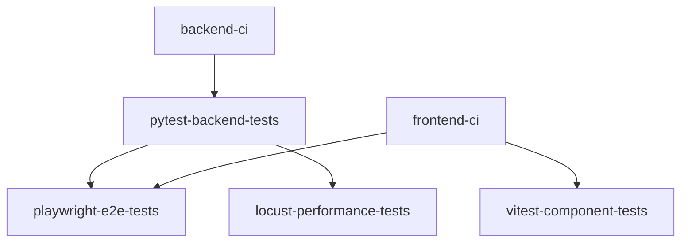

# Especificación del flujo de integración y despliegue continuos (CI/CD)

Este documento detalla el flujo de trabajo automatizado diseñado para **Quizzie**, con el fin de garantizar la calidad del software, la seguridad de las dependencias y la disponibilidad continua del servicio mediante un proceso de entrega profesional.

---

## 1. Ciclo de vida y flujo de trabajo (Workflow)
El proyecto implementa un flujo de trabajo secuencial que abarca desde el desarrollo local hasta la puesta en producción:

1. **Etapa 1 - Verificación Local (Pre-commit hooks):** Antes de registrar cualquier commit, se ejecutan comprobaciones automáticas en el entorno local (linting y formateo para backend y frontend).
2. **Etapa 2 - Integración Continua (CI):** Tras realizar `push` o `pull request` hacia las ramas `develop` o `main`, GitHub Actions ejecuta las etapas organizadas de análisis estático, pruebas unitarias, pruebas de componentes, pruebas E2E y pruebas de rendimiento.
3. **Etapa 3 - Análisis de Calidad Continuo (SonarQube):** Tras consolidar cambios en `main` mediante la aprobación de la Pull Request o la fusión desde `develop`, se ejecuta el análisis estático de código en SonarCloud (`sonar.yml`).
4. **Etapa 4 - Despliegue Continuo (CD):** Al realizar el push/merge a `main`, el workflow independiente `.github/workflows/deploy.yml` activa de inmediato el webhook de despliegue en producción (Render).

---

## 2. Verificación local (pre-commit hooks)

Para evitar que los commits fallen posteriormente en la etapa de CI en remoto, Git ejecuta comprobaciones locales automáticas en el entorno del desarrollador antes de registrar cada commit.

*Nota: La instalación, el desglose completo de los hooks configurados en `.pre-commit-config.yaml` y las órdenes de auditoría se encuentran en el documento `docs/calidad_del_código.md`.*

---

## 3. Pipeline de Integración Continua (CI)

La Integración Continua de **Quizzie** se compone de dos workflows diferenciados en GitHub Actions:

### A. Pipeline de Validación de Calidad y Seguridad (`quality_and_security.yml`)
Se activa ante cualquier `push` en la rama `develop` o al abrir/actualizar una `Pull Request` hacia `main` o `develop`. Está estructurado en 6 jobs interconectados:

#### Detalle de jobs del pipeline:

1. **`backend-ci` (Análisis Estático Backend):**
   * **Herramientas:** Ruff (`uvx ruff check .` y `uvx ruff format . --check`) + Security Audit (`uvx pip-audit`).
2. **`pytest-backend-tests` (Pruebas Unitarias e Integración Backend):**
   * **Dependencia:** `needs: [backend-ci]`
   * **Pruebas:** `uv run pytest --cov=backend --cov-report=xml` y exportación de artefacto `backend-coverage`.
3. **`frontend-ci` (Análisis Estático Frontend):**
   * **Herramientas:** ESLint (`npm run lint`) y compilación TypeScript (`npm run build`).
4. **`vitest-component-tests` (Pruebas de Componentes Frontend):**
   * **Dependencia:** `needs: [frontend-ci]`
   * **Pruebas:** `npm run test:frontend:coverage` en el directorio `./frontend` y exportación de cobertura.
5. **`playwright-e2e-tests` (Pruebas End-to-End Navegables):**
   * **Dependencia:** `needs: [pytest-backend-tests, frontend-ci]`
   * **Entorno:** Poblamiento de BD (`uv run python backend/seed.py`), servidor FastAPI en segundo plano (`127.0.0.1:8000`) e instalación de navegadores (`npx playwright install --with-deps`).
   * **Pruebas:** Ejecución de specs `CU-01` a `CU-10` (`npm run test:e2e`) y exportación de reportes HTML.
6. **`locust-performance-tests` (Pruebas de Carga y Evaluación de SLAs):**
   * **Dependencia:** `needs: [pytest-backend-tests]`
   * **Generación de métricas (Locust):** `uv run python tests/performance/run_performance_tests.py -u 200 -r 15 -t 1m` (ejecuta la simulación de carga headless para registrar y generar los artefactos de métricas en formato CSV).
   * **Auditoría de SLAs (Control de Paso/Fallo):** `uv run python tests/performance/evaluate_thresholds.py` (audita el reporte CSV verificando que la tasa global de errores sea `< 1.0%` y las latencias P90 cumplan los límites definidos: REST `<= 200 ms` y auth/pesadas `<= 500 ms`, determinando en última instancia si el job se aprueba en verde o se rechaza en rojo).

### B. Pipeline de análisis de calidad continuo SonarQube (`sonar.yml`)
Se activa automáticamente tras realizar un `push` o consolidar una Pull Request aprobada en la rama principal (`main`):

* **Trigger:** `push` a la rama `main`.
* **Proceso de análisis:**
  1. **Generación de cobertura:** Ejecuta `pytest --cov=backend --cov-report=xml` para generar el informe actualizado de cobertura de código backend.
  2. **Caché de dependencias:** Utiliza `actions/cache@v4` para reutilizar la caché de paquetes de SonarCloud (`~/.sonar/cache`).
  3. **Escaneo de SonarQube:** Ejecuta la acción oficial `SonarSource/sonarqube-scan-action@v5` autenticada mediante `SONAR_TOKEN` para evaluar deuda técnica, duplicación de código y vulnerabilidades en la plataforma SonarCloud.

---

## 4. Estrategia de Despliegue Continuo (CD)

### A. Despliegue del Frontend (Vercel)
* **Trigger:** Nuevos commits en la rama `main`.
* **Condición:** Activación condicionada al éxito previo de las pruebas de CI en `develop`/PR.

### B. Despliegue del Backend (Render)
* **Trigger:** Invocación controlada del Deploy Hook mediante el workflow `.github/workflows/deploy.yml`.
* **Condición:** Activación automática al hacer `push` o `merge` hacia la rama `main`. No vuelve a ejecutar la batería de pruebas puesto que los Branch Protection Rules de GitHub garantizan que `main` solo recibe commits cuyas PRs hayan pasado la suite completa de calidad.

---

## 5. Resumen del flujo técnico (Orden cronológico)

1. **[Desarrollo Local]** ──> Pre-commit Hooks (Ruff + ESLint local)
2. **[Push / PR a develop]** ──> GitHub Actions (`quality_and_security.yml`):
                               * **Backend:** `backend-ci` ──> `pytest-backend-tests` ──> `locust-performance-tests`
                               * **Frontend:** `frontend-ci` ──> `vitest-component-tests`
                               * **Integración E2E:** `pytest-backend-tests` + `frontend-ci` ──> `playwright-e2e-tests`
3. **[Merge a main]** ──────> SonarQube Scan (`sonar.yml`) + CD Deploy Hook (`deploy.yml`) tras superar Vitest, Playwright y Locust.
