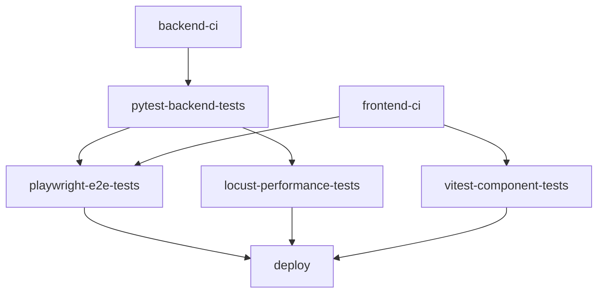

# Especificación del flujo de integración y despliegue continuos (CI/CD)

Este documento detalla el flujo de trabajo automatizado diseñado para **Quizzie**, con el fin de garantizar la calidad del software, la seguridad de las dependencias y la disponibilidad continua del servicio mediante un proceso de entrega profesional.

---

## 1. Ciclo de vida y flujo de trabajo (Workflow)
El proyecto implementa un flujo de trabajo secuencial que abarca desde el desarrollo local hasta la puesta en producción:

1. **Etapa 1 - Verificación Local (Pre-commit hooks):** Antes de registrar cualquier commit, se ejecutan comprobaciones automáticas en el entorno local (linting y formateo para backend y frontend).
2. **Etapa 2 - Integración Continua (CI):** Tras realizar `push` o `pull request` hacia las ramas `develop` o `main`, GitHub Actions ejecuta las etapas organizadas de análisis estático, pruebas unitarias, pruebas de componentes, pruebas E2E y pruebas de rendimiento de carga.
3. **Etapa 3 - Análisis de Calidad Continuo (SonarQube):** Tras consolidar cambios en `main`, se ejecuta el análisis estático de código en SonarCloud.
4. **Etapa 4 - Despliegue Continuo (CD):** Al superar con éxito la batería completa de pruebas en `main`, el servicio se despliega automáticamente en producción (Render/Vercel).

---

## 2. Verificación Local (Pre-commit hooks)
Para evitar que los commits fallen posteriormente en la etapa de CI en remoto, el archivo `.pre-commit-config.yaml` intercepta la creación de commits y aplica comprobaciones y correcciones automáticas:

* **Backend (Python):**
  * **Ruff Check:** Ejecuta `ruff check --fix` para detectar y corregir errores estáticos.
  * **Ruff Format:** Formatea el código de Python respetando las reglas de estilo del proyecto (`ruff-format`).
* **Frontend (TypeScript / React):**
  * **ESLint Local:** Ejecuta `npx eslint --config frontend/eslint.config.js --fix` sobre los archivos modificados bajo `frontend/src/`, asegurando que las reglas de ESLint y Prettier se apliquen con la misma configuración exacta que en la integración continua.
* **Utilidades Generales:**
  * `trailing-whitespace`: Elimina espacios innecesarios al final de cada línea.
  * `end-of-file-fixer`: Asegura que todos los archivos terminen con una línea en blanco.
  * `check-yaml`: Valida la sintaxis de los archivos YAML.
  * `check-added-large-files`: Evita incluir accidentalmente archivos de gran tamaño.

---

## 3. Pipeline de Integración Continua (CI)

El flujo de CI principal se gestiona mediante el workflow `[.github/workflows/quality_and_security.yml](file:///c:/WS-TFG/quizzie-tfg/.github/workflows/quality_and_security.yml)` en **GitHub Actions**, estructurado en 6 jobs interconectados:

### Detalle de Jobs del Pipeline:

1. **`backend-ci` (Análisis Estático Backend):**
   * **Herramientas:** Ruff (`uvx ruff check .` y `uvx ruff format . --check`) + Security Audit (`uvx pip-audit`).
2. **`pytest-backend-tests` (Pruebas Unitarias e Integración Backend):**
   * **Dependencia:** `needs: [backend-ci]`
   * **Pruebas:** `uv run pytest --cov=backend --cov-report=xml` y exportación de artefacto `backend-coverage`.
3. **`frontend-ci` (Análisis Estático Frontend):**
   * **Herramientas:** ESLint (`npm run lint`) y compilación TypeScript (`npm run build`).
4. **`vitest-component-tests` (Pruebas de Componentes Frontend):**
   * **Dependencia:** `needs: [frontend-ci]`
   * **Pruebas:** `npm run test:frontend:coverage` en el directorio `./frontend` y exportación de cobertura.
5. **`playwright-e2e-tests` (Pruebas End-to-End Navegables):**
   * **Dependencia:** `needs: [pytest-backend-tests, frontend-ci]`
   * **Entorno:** Poblamiento de BD (`uv run python backend/seed.py`), servidor FastAPI en segundo plano (`127.0.0.1:8000`) e instalación de navegadores (`npx playwright install --with-deps`).
   * **Pruebas:** Ejecución de specs `CU-01` a `CU-10` (`npm run test:e2e`) y exportación de reportes HTML.
6. **`locust-performance-tests` (Pruebas de Carga y Evaluación de SLAs):**
   * **Dependencia:** `needs: [pytest-backend-tests]`
   * **Simulación:** `uv run python tests/performance/run_performance_tests.py -u 200 -r 15 -t 1m`
   * **Auditoría de SLAs:** `uv run python tests/performance/evaluate_thresholds.py` y exportación de informes CSV (`benchmark_results*.csv`).

---

## 4. Estrategia de Despliegue Continuo (CD)

### A. Despliegue del Frontend (Vercel)
* **Trigger:** Nuevos commits en la rama `main`.
* **Condición:** Activación condicionada al éxito previo de las pruebas de CI.

### B. Despliegue del Backend (Render)
* **Trigger:** Invocación controlada del Deploy Hook mediante GitHub Actions en el job `deploy`.
* **Condición:** `needs: [vitest-component-tests, playwright-e2e-tests, locust-performance-tests]` en la rama `main`. No se despliega código que viole umbrales de rendimiento ni funcionalidad.

---

## 5. Resumen del flujo técnico (Orden cronológico)

1. **[Desarrollo Local]** ──> Pre-commit Hooks (Ruff + ESLint local)
2. **[Push / PR]** ─────────> GitHub Actions (`quality_and_security.yml`):
                              * **Backend:** `backend-ci` ──> `pytest-backend-tests` ──> `locust-performance-tests`
                              * **Frontend:** `frontend-ci` ──> `vitest-component-tests`
                              * **Integración E2E:** `pytest-backend-tests` + `frontend-ci` ──> `playwright-e2e-tests`
3. **[Merge a main]** ──────> SonarQube Scan (`sonar.yml`) + CD Deploy Hook (`deploy`) tras superar Vitest, Playwright y Locust.
