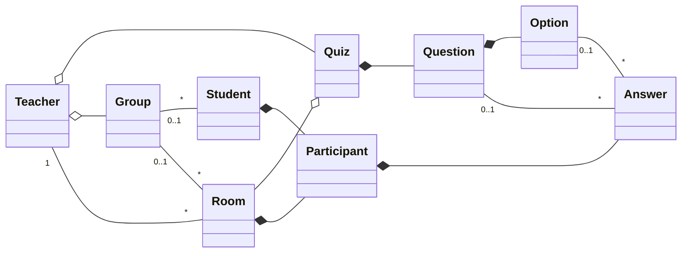
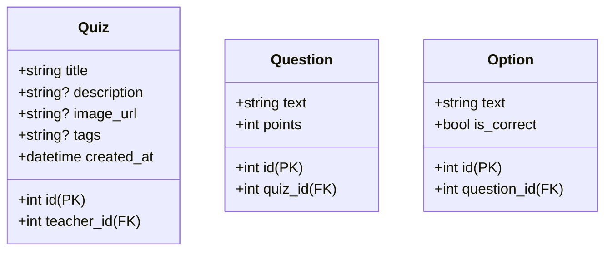
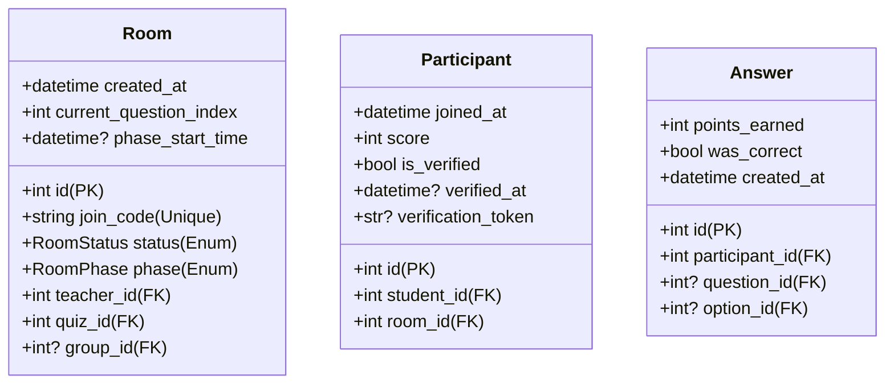
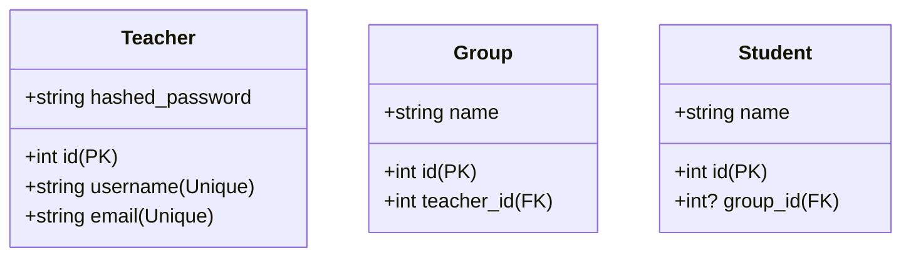

# Especificación del Modelo de Datos

## 1. Diagrama de Entidades (ER)
El siguiente diagrama describe las relaciones lógicas entre las entidades del sistema. Se destaca la jerarquía de contenidos (Quiz -> Pregunta -> Opción) y la dinámica de participación en tiempo real (Sala -> Participante -> Respuesta), todo esto apoyado en los usuarios (Profesor, Estudiante y Grupo)

## 2. Requisitos de Información (RI)

A continuación se describen los campos, tipos de datos y propósitos de cada entidad del sistema para su implementación en la base de datos.

### Contenido
| Entidad | Atributo | Tipo | Descripción |
| :--- | :--- | :--- | :--- |
| **Quiz** | id | int (PK) | Identificador único del cuestionario. |
| | title | str | Título descriptivo del test. |
| | description | str | Explicación extendida del contenido. |
| | image_url | Optional[str] | URL de la imagen de portada del test. |
| | tags | Optional[str] | Etiquetas o palabras clave del cuestionario. |
| | created_at | datetime | Fecha y hora de creación (UTC). |
| | teacher_id | int (FK) | Relación con el docente propietario. |
| **Question** | id | int (PK) | Identificador único de la pregunta. |
| | text | str | Enunciado o texto de la pregunta. |
| | points | int | Valoración (por defecto 1). |
| | quiz_id | int (FK) | Relación con el cuestionario padre. |
| **Option** | id | int (PK) | Identificador único de la opción. |
| | text | str | Texto de la respuesta. |
| | is_correct | bool | Indica si es la opción válida (default=False). |
| | question_id | int (FK) | Relación con la pregunta asociada. |

### Sesiones
| Entidad | Atributo | Tipo | Descripción |
| :--- | :--- | :--- | :--- |
| **Room** | id | int (PK) | Identificador único de la sesión. |
| | join_code | str | PIN único de acceso. |
| | status | RoomStatus (Enum) | Estado actual: waiting, live o finished. |
| | created_at | datetime | Fecha y hora de creación de la sala (UTC). |
| | current_question_index | int | Índice de la pregunta activa en la sesión. |
| | phase | RoomPhase (Enum) | Fase actual: reading, answering, results, leaderboard. |
| | phase_start_time | datetime | Momento en el que se inició la fase actual. |
| | teacher_id | int (FK) | Profesor que administra la sala. |
| | quiz_id | int (FK) | Cuestionario asociado a la sesión. |
| | group_id | Optional[int] (FK) | Grupo vinculado a la sala. |
| **Participant** | id | int (PK) | Identificador único de participación. |
| | joined_at | datetime | Momento exacto de unión a la sala. |
| | score | int | Puntuación acumulada de las preguntas acertadas. |
| | is_verified | bool | Indica si se ha verificado la participación y la nota. |
| | verified_at | Optional[datetime]     | Momento en el que se verificó la participación y la nota. |
| | verification_token | Optional[str] | Token único para verificar la participación y la nota. |
| | student_id | int (FK) | Alumno que participa. |
| | room_id | int (FK) | Sala a la que pertenece el registro. |
| **Answer** | id | int (PK) | Identificador único de la respuesta. |
| | points_earned | int | Puntos obtenidos por la respuesta (default 0). |
| | was_correct | bool | Indica si la respuesta fue acertada. |
| | created_at | datetime | Momento en el que se emitió la respuesta. |
| | participant_id | int (FK) | Alumno que emite la respuesta. |
| | question_id | Optional[int] (FK) | Pregunta respondida (nulo si se borra la pregunta pero queremos persistir el resultado). |
| | option_id | Optional[int] (FK) | Opción seleccionada (nulo si se borra la opción  pero queremos persistir el resultado). |

### Usuarios
| Entidad | Atributo | Tipo | Descripción |
| :--- | :--- | :--- | :--- |
| **Teacher** | id | int (PK) | Identificador único del docente. |
| | username | str | Nombre de usuario (Único e Indexado). |
| | email | str | Correo electrónico único de contacto. |
| | hashed_password | str | Contraseña cifrada (Censurada en lecturas API). |
| **Group** | id | int (PK) | Identificador único de la clase o grupo. |
| | name | str | Nombre descriptivo del grupo. |
| | teacher_id | int (FK) | Relación con el profesor propietario. |
| **Student** | id | int (PK) | Identificador único del alumno. |
| | name | str | Nickname o nombre del alumno. |
| | group_id | Optional[int]  | Relación con el grupo asignado. |

*Nota: Para poder visualizar correctamente los diagramas en Visual Studio Code es necesario tener la extensión de Mermaid instalada*