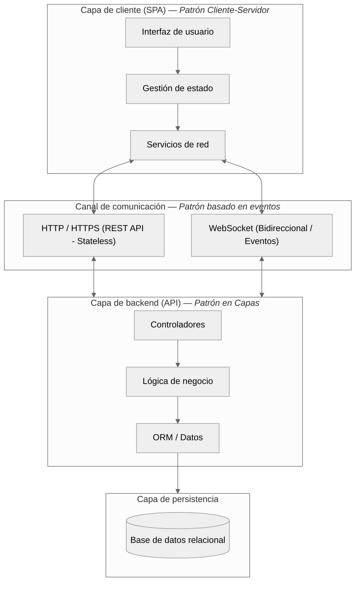
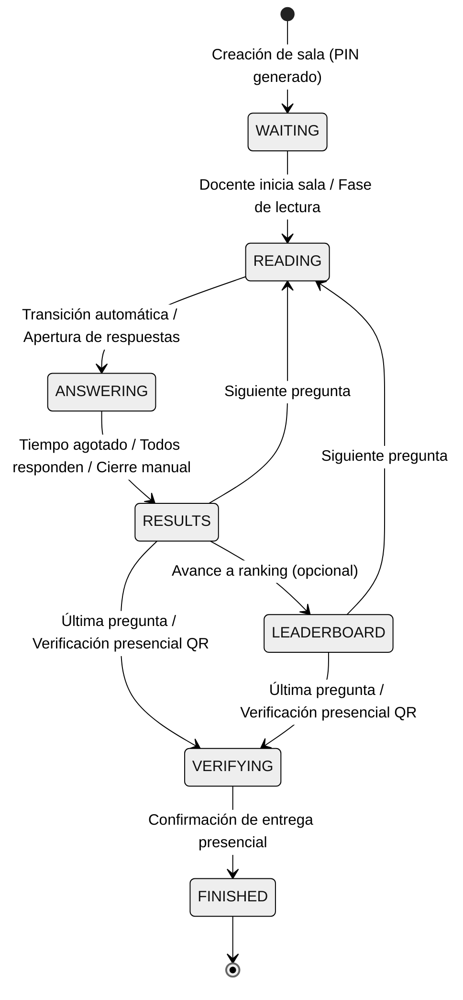
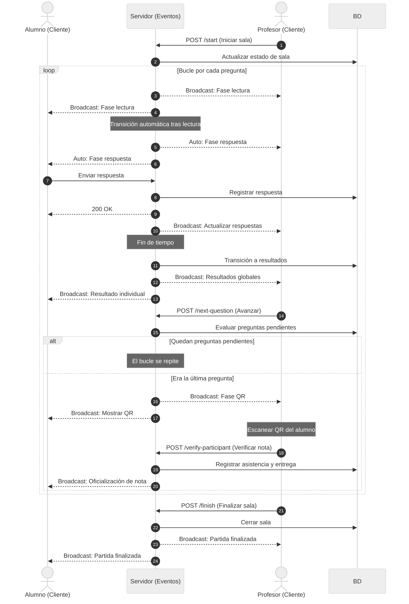

# Patrones arquitectónicos y diseño del sistema - Quizzie

Este documento describe conceptualmente la arquitectura del software, los patrones arquitectónicos seleccionados, la estructura modular del código y la vinculación con el modelo de datos del proyecto **Quizzie**. Su objetivo es servir como base de diseño técnico para la redacción del capítulo `sections/06_Diseño_y_arquitectura.tex` de la memoria del Trabajo de Fin de Grado (TFG).

---

## 1. Patrones arquitectónicos elegidos y justificación

El diseño de **Quizzie** responde a los requisitos de una aplicación web interactiva en tiempo real orientada a la gamificación educativa. Para garantizar un alto grado de mantenibilidad, flexibilidad y rendimiento en escenarios de concurrencia (como el uso simultáneo por múltiples alumnos en una misma aula), se han combinado tres patrones arquitectónicos fundamentales: **cliente-servidor (desacoplado)**, **arquitectura en capas (layered architecture)** y **arquitectura basada en eventos (event-driven architecture)**.



---

### 1.1. Arquitectura cliente-servidor desacoplada

La aplicación adopta una arquitectura cliente-servidor pura con un desacoplamiento estricto entre la interfaz de usuario (*frontend*) y los servicios del servidor (*backend*):

* **Cliente (frontend - SPA):** Desarrollado como una aplicación de página única (*Single Page Application*). Es responsable exclusivo de la representación visual, la experiencia de usuario, los temporizadores locales de apoyo y el renderizado reactivo de la interfaz gamificada. El cliente opera sin acceso directo a los datos ni a la lógica de puntuación, delegando la computación en el servidor.
* **Servidor (backend - API REST + WebSockets):** Actúa como la única fuente de verdad (*single source of truth*), gestionando la autenticación, la seguridad criptográfica, el ciclo de vida de los cuestionarios, la persistencia en base de datos y la orquestación síncrona de las salas.
* **Canales de comunicación:**
  * **HTTP/HTTPS (REST API):** Para operaciones síncronas sin estado (*stateless*), tales como la autenticación de usuarios, la gestión de contenidos de cuestionarios, la configuración de salas y la consulta de informes históricos.
  * **WebSockets:** Para mantener un canal de comunicación persistente, bidireccional y de baja latencia durante la ejecución en vivo de los cuestionarios entre el docente, los alumnos y el servidor.

#### Justificación técnica
El desacoplamiento entre cliente y servidor permite la evolución independiente de ambas partes (por ejemplo, posibilitando el desarrollo futuro de una aplicación móvil sin modificar la lógica del servidor), optimiza la distribución de activos estáticos y descarga de trabajo al servidor al centralizar en este únicamente los cálculos y la sincronización en tiempo real.

---

### 1.2. Arquitectura en capas (layered architecture)

Tanto el servidor como el cliente siguen una separación estricta en capas conceptuales con responsabilidades delimitadas (*separation of concerns*).

#### A. Capas del backend

1. **Capa de presentación y controladores:**
   * Expone los puntos de entrada HTTP (endpoints REST) y los canales de comunicación WebSocket.
   * Valida la estructura de las peticiones de entrada, gestiona el formato de las respuestas y coordina la autenticación de las solicitudes.

2. **Capa de lógica de negocio y servicios:**
   * Contiene las reglas del dominio de la aplicación: algoritmos de puntuación en función del tiempo de respuesta, transiciones de estado de las salas, mecanismos de barajado aleatorio de preguntas y opciones, y lógica de verificación.
   * Coordina la orquestación de tareas en segundo plano, como la sincronización periódica de temporizadores.

3. **Capa de acceso a datos y modelado (ORM):**
   * Mapea las entidades de negocio del dominio con el modelo relacional subyacente.
   * Garantiza las restricciones de integridad referencial, relaciones entre entidades e índices para optimizar las consultas.

4. **Capa de persistencia:**
   * Administra la conexión con el motor de base de datos relacional y gestiona las transacciones de lectura y escritura.

#### B. Capas del frontend

1. **Capa de vistas y componentes de interfaz:**
   * Componentes modulares y reutilizables encargados del renderizado de las pantallas y de la captura de interacción del usuario.

2. **Capa de estado y contexto:**
   * Almacena y gestiona el estado global de la sesión de usuario y el estado local de la partida en vivo durante la navegación.

3. **Capa de servicios de red:**
   * Encapsula la lógica de comunicación síncrona (REST) y la suscripción al canal de eventos bidireccional (WebSockets).

4. **Capa de contratos de datos:**
   * Define los tipos e interfaces que formalizan las estructuras de datos intercambiadas con el servidor.

---

### 1.3. Arquitectura basada en eventos para salas en tiempo real

El núcleo gamificado de la aplicación exige que el profesor y todos los alumnos conectados a una sala observen el estado del juego de forma sincronizada. Para lograrlo, se implementa un patrón basado en eventos conducido por WebSockets.



#### Componentes clave de la arquitectura por eventos:

1. **Gestor centralizado de conexiones:**
   * Mantiene el registro de las conexiones activas agrupadas por sala.
   * Administra el ciclo de vida de las conexiones (alta, baja y desconexión por inactividad).
   * Implementa el patrón de **difusión (*broadcasting*)**, permitiendo enviar mensajes e instrucciones a todos los participantes de una sala de forma simultánea.

2. **Bucle de sincronización asíncrono:**
   * Proceso asíncrono en segundo plano que supervisa el transcurso del tiempo de respuesta en las salas activas.
   * Notifica a los clientes el tiempo restante de forma periódica y desencadena automáticamente la transición hacia la fase de resultados cuando el tiempo expira.

3. **Ciclo de eventos y transmisión:**
   * Los cambios de estado de la sala (paso a fase de lectura, apertura de respuestas, muestra de resultados, actualización de temporizador) se propagan como eventos JSON hacia los clientes, permitiendo que la interfaz de usuario reaccione de forma inmediata.



---

### 1.4. Separación de responsabilidades y escalabilidad del sistema

#### A. Separación de responsabilidades
* **Validación centralizada en servidor:** El cliente no toma decisiones sobre la corrección de respuestas, el cálculo de puntos ni la temporización oficial de la sala. El servidor actúa como árbitro central para evitar inconsistencias o manipulaciones del juego (*anti-cheat*).
* **Desacoplamiento de la presentación:** El servidor solo emite los eventos y datos conceptuales del juego. El cliente es el encargado de interpretar dichos eventos y representarlos mediante transiciones e interfaces reactivas.

#### B. Escalabilidad del sistema
* **Escalabilidad horizontal del frontend:** La separación como aplicación de página única permite servir los activos estáticos desde redes de distribución de contenido (CDN), garantizando tiempos de respuesta reducidos sin sobrecargar el servidor.
* **Manejo asíncrono de la concurrencia:** El uso de un servidor ASGI asíncrono permite gestionar múltiples conexiones WebSocket abiertas de manera eficiente sin bloquear hilos de ejecución.
* **Autenticación sin estado (*stateless*):** La autenticación basada en tokens integrados en las cabeceras de cada solicitud REST evita almacenar datos de sesión en la memoria del servidor, facilitando el escalado del backend tras un balanceador de carga.
* **Abstracción de la capa de datos:** El uso de una capa de mapeo objeto-relacional independiza la lógica de negocio del motor de base de datos específico, permitiendo adaptar la infraestructura de almacenamiento según las necesidades de despliegue.

---

## 2. Estructura modular del código

El proyecto se organiza en módulos independientes con responsabilidades claras, facilitando la mantenibilidad y la escalabilidad del sistema.

```
quizzie-tfg/
├── backend/                  # Servidor de aplicación y API
│   ├── main.py               # Punto de entrada de la aplicación y ciclo de vida
│   ├── database.py           # Configuración y conexión con la base de datos
│   ├── auth.py               # Servicios de autenticación y seguridad
│   ├── email_service.py      # Servicio de notificaciones por correo
│   ├── models/               # Definición de entidades del dominio
│   ├── routers/              # Controladores de la API REST y WebSockets
│   └── schemas/              # Objetos de transferencia de datos (DTO)
│
├── frontend/                 # Cliente web (Single Page Application)
│   ├── src/
│   │   ├── main.tsx          # Punto de entrada del cliente
│   │   ├── App.tsx           # Enrutamiento principal y estructura base
│   │   ├── api.ts            # Cliente para comunicación HTTP REST
│   │   ├── types.ts          # Definición de contratos y tipos de datos
│   │   ├── auth/             # Módulo de autenticación de usuarios
│   │   ├── management/       # Módulo de gestión docente (cuestionarios y grupos)
│   │   ├── room-access/      # Módulo de incorporación de alumnos a salas
│   │   ├── room-play/        # Módulo de interacción de partida en vivo
│   │   ├── context/          # Gestión del estado global de sesión
│   │   ├── hooks/            # Lógica reutilizable de interacción y estado
│   │   └── layouts/          # Componentes de estructura visual y plantillas
│
├── docs/                     # Especificaciones y documentos de diseño
└── tests/                    # Pruebas unitarias y de integración
```

---

## 3. Vinculación con el modelo de datos

La especificación detallada del modelo de datos del dominio (diagramas de clases entidad-relación, requisitos de información, atributos y tipos de datos) se encuentra descrita en el documento **[docs/modelo_de_datos.md].
Desde el punto de vista del diseño de la arquitectura, las entidades del sistema se agrupan en tres subdominios conceptuales que se integran en la capa de acceso a datos:

1. **Subdominio de usuarios y grupos:** Entidades relativas a la gestión de docentes, clases/grupos y alumnos.
2. **Subdominio de contenido:** Entidades relativas a la estructura de cuestionarios, preguntas y opciones de respuesta.
3. **Subdominio de escenario en tiempo real:** Entidades relativas al estado de la sala, registro de participantes y almacenamiento de respuestas emitidas.

Esta división modular del modelo de datos asegura que la persistencia se vincule limpiamente con la arquitectura en capas y la transmisión de eventos, sin acoplar el esquema relacional con la interfaz visual.
