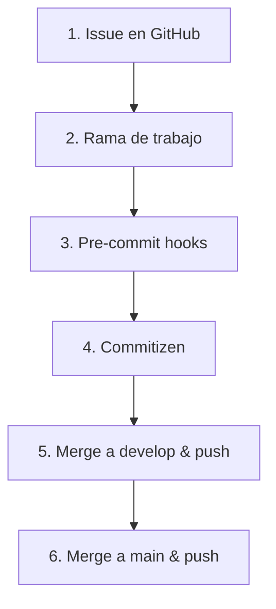
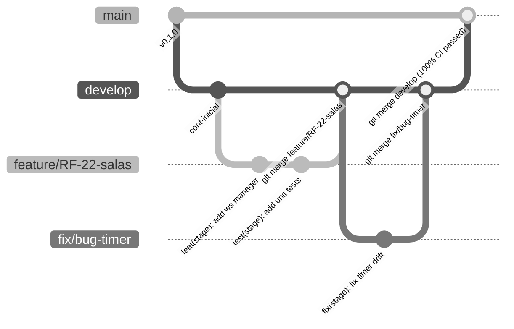

# Políticas del repositorio y gestión del flujo de trabajo - Quizzie

Este documento establece las normativas, estándares de código, flujo de ramificación y gestión del ciclo de desarrollo para el proyecto **Quizzie**. Su objetivo es garantizar la trazabilidad entre requisitos y código, la calidad del software mediante verificaciones locales y la estabilidad de las versiones en producción mediante automatizaciones de CI/CD.

---

## Flujo de trabajo secuencial (paso a paso)

El ciclo de desarrollo en **Quizzie** sigue un orden estricto de trabajo en 6 etapas:



---

## 1. Gestión de tareas (GitHub Issues)

Todo trabajo debe iniciarse asociándolo a un **GitHub Issue** para garantizar la trazabilidad con los requisitos y objetivos del proyecto.

### 1.1. Plantillas de issues (`.github/ISSUE_TEMPLATE`)
Se debe emplear la plantilla YAML adecuada según la naturaleza de la tarea (ubicadas en [`.github/ISSUE_TEMPLATE`](file:///c:/WS-TFG/quizzie-tfg/.github/ISSUE_TEMPLATE)):

* **`feature_request.yml` (Nuevas funcionalidades / RF):** Diseñada para tareas asociadas a Requisitos Funcionales. Requiere vincular el ID del requisito (ej. `RF-07`), el objetivo asociado (`OBJ-02`), la descripción técnica y los criterios de aceptación.
* **`docs.yml` (Documentación):** Diseñada para la redacción de la memoria en LaTeX o documentos técnicos en Markdown. Especifica el documento o capítulo afectado y los criterios de revisión.
* **`devops.yml` (Infraestructura y CI/CD):** Diseñada para tareas de automatización, GitHub Actions, SonarCloud o configuración de despliegues.
* **`test.yml` (Estrategias y baterías de pruebas):** Diseñada para la creación o ampliación de pruebas (Pytest, Vitest, Playwright o Locust).

---

## 2. Estrategia de ramas y convención de nombres

El proyecto adopta un modelo basado en **Git Flow simplificado** utilizando únicamente ramas locales e integración directa mediante `git merge` (sin uso de Pull Requests).

### 2.1. Tipos de ramas y convenciones de nombres

| Tipo de rama | Dominio / propósito | Rama origen | Rama destino | Ejemplo de nombre |
| :--- | :--- | :--- | :--- | :--- |
| **`main`** | Código estable en producción. Solo recibe código probado y validado. | — | — | `main` |
| **`develop`** | Rama principal de integración y desarrollo continuo. | `main` | `main` | `develop` |
| **`feature/*`** | Implementación de Requisitos Funcionales (RF). | `develop` | `develop` | `feature/RF-04-crear-quiz` |
| **`fix/*`** | Corrección de errores y bugs en código existente. | `develop` | `develop` | `fix/timer-pause-drift` |
| **`docs/*`** | Actualización de documentación técnica o memoria TFG. | `develop` | `develop` | `docs/especificacion-ci-cd` |
| **`test/*`** | Incorporación o mejora de baterías de pruebas. | `develop` | `develop` | `test/e2e-validar-qr` |
| **`refactor/*`** | Reestructuración de código sin alterar comportamiento. | `develop` | `develop` | `refactor/connection-manager` |
| **`build/*`** | Modificación de workflows CI/CD, dependencias o infraestructura de compilación/despliegue. | `develop` | `develop` | `build/sonar-pipeline` |

### 2.2. Diagrama del flujo de ramificación



---

## 3. Verificación local automática (pre-commit hooks)

Antes de registrar cualquier commit, Git ejecuta automáticamente los hooks configurados en `.pre-commit-config.yaml` para asegurar el formato y paso de linters (Ruff para backend y ESLint para frontend).

*Nota: El desglose técnico completo de los hooks configurados, instalación y normas de calidad se encuentra en el documento `docs/calidad_del_codigo.md`*

---

## 4. Estándar de commits (Conventional Commits + Commitizen)

El proyecto exige la especificación **Conventional Commits** gestionada mediante la herramienta **Commitizen**, garantizando un historial de versiones limpio, legible y compatible con *Semantic Versioning* (SemVer).

### 4.1. Sintaxis obligatoria
$$\text{<tipo>}(\text{<alcance\_opcional>}): \text{<descripción\_corta>}$$

### 4.2. Tipos de commits permitidos
| Tipo (`type`) | Definición | Impacto SemVer | Ejemplo |
| :--- | :--- | :--- | :--- |
| **`feat`** | Incorporación de una nueva funcionalidad para el usuario. | **MINOR** (`0.x.0`) | `feat(stage): implement QR validation endpoint` |
| **`fix`** | Corrección de un error o fallo de código. | **PATCH** (`0.0.x`) | `fix(auth): resolve JWT expiration token parsing` |
| **`docs`** | Cambios exclusivos en la documentación (markdown, memoria TFG). | Sin impacto | `docs(ci): update pipeline specifications` |
| **`style`** | Ajustes de formato o estilo que no alteran la lógica. | Sin impacto | `style(frontend): format JSX components with Prettier` |
| **`refactor`** | Reestructuración interna de código sin añadir funciones ni reparar bugs. | Sin impacto | `refactor(db): optimize SQLModel relationships` |
| **`perf`** | Mejora del rendimiento del sistema. | Sin impacto | `perf(ws): optimize connection manager broadcast` |
| **`test`** | Añadir o corregir pruebas unitarias, integración, E2E o carga. | Sin impacto | `test(e2e): add test spec for CU-07 QR scanning` |
| **`build`** | Cambios en el sistema de compilación, herramientas o dependencias externas. | Sin impacto | `build(deps): bump fastapi to 0.128.0` |
| **`ci`** | Modificaciones en archivos de configuración CI/CD (GitHub Actions). | Sin impacto | `ci(sonar): update sonarqube scan action` |
| **`chore`** | Tareas rutinarias de mantenimiento o configuración secundaria. | Sin impacto | `chore(gitignore): ignore coverage artifacts` |
| **`revert`** | Reversión de un commit previo. | Sin impacto | `revert: undo previous commit on stage router` |

### 4.3. Configuración y comando interactivo
La configuración de Commitizen se encuentra centralizada en [`pyproject.toml`](file:///c:/WS-TFG/quizzie-tfg/pyproject.toml). Para crear los commits respetando la norma:
```bash
uv run cz commit
# o de forma abreviada
git cz
```

---

## 5. Integración a `develop` (merge local y push)

En **Quizzie** **nunca se emplean Pull Requests**. La consolidación de cambios en la rama `develop` se realiza mediante fusión local directa (*direct merge*):

1. Una vez completado el desarrollo y tras haber superado los pre-commit hooks y pruebas locales:
   ```bash
   git checkout develop
   git merge <nombre-de-la-rama>
   ```
2. Subir la rama `develop` actualizada al repositorio remoto:
   ```bash
   git push origin develop
   ```
3. Opcionalmente, eliminar la rama temporal local y remotamente tras la integración exitosa.

---

## 6. Fusión a `main` y paso a producción

La rama `main` refleja el código desplegado en producción.

> [!CAUTION]
> **Norma fundamental para el push a `main`:**
> **Solo está permitido hacer `git push` a la rama `main` si el workflow de Integración Continua en la rama `develop` se ha ejecutado y ha finalizado de forma completamente satisfactoria (en verde / 100% pasado).**
>
> *(Nota: Para consultar el detalle exhaustivo de la suite de comprobaciones del pipeline de CI, véase el documento [`docs/especificación_ci_cd.md`](file:///c:/WS-TFG/quizzie-tfg/docs/especificaci%C3%B3n_ci_cd.md)).*

### 6.1. Procedimiento de integración a `main`
Cuando las ejecuciones en `develop` confirmen el estado verde del workflow remoto:
```bash
git checkout main
git merge develop
git push origin main
```
Esta acción desencadena el despliegue automático hacia el entorno de producción.
